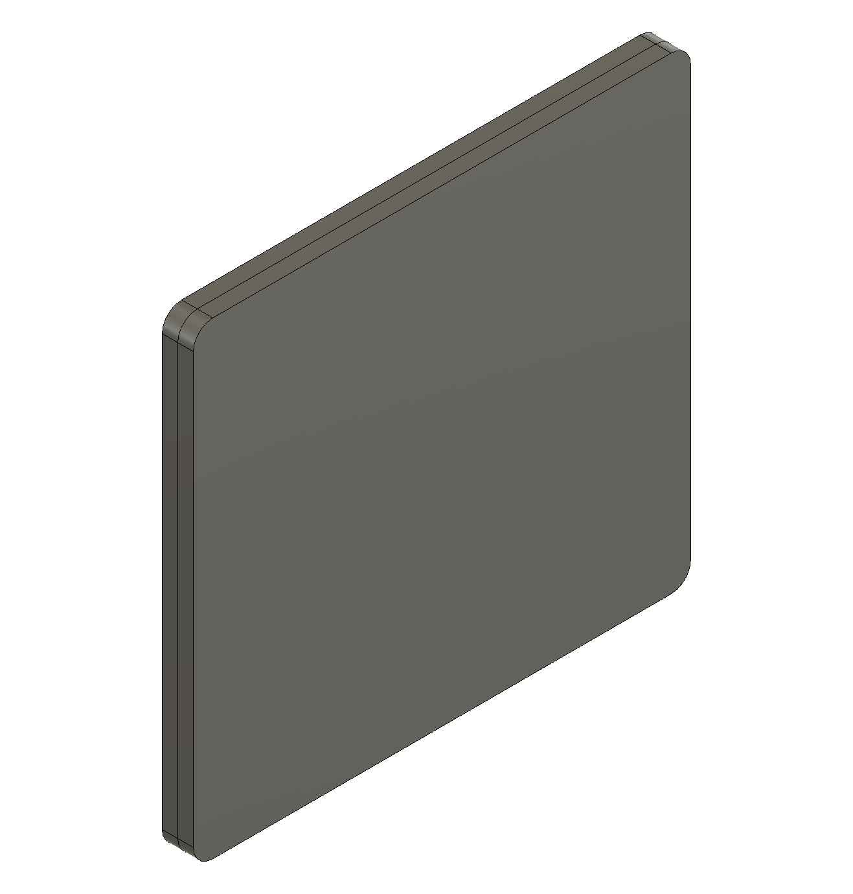
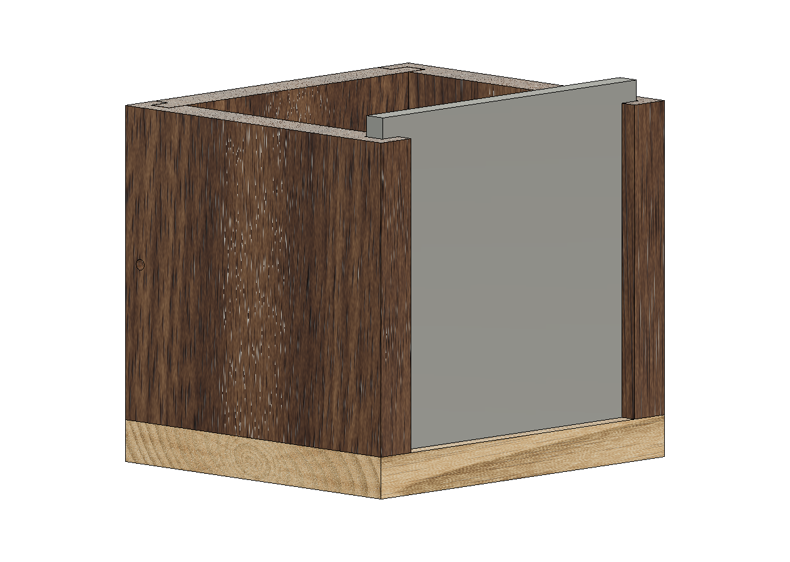
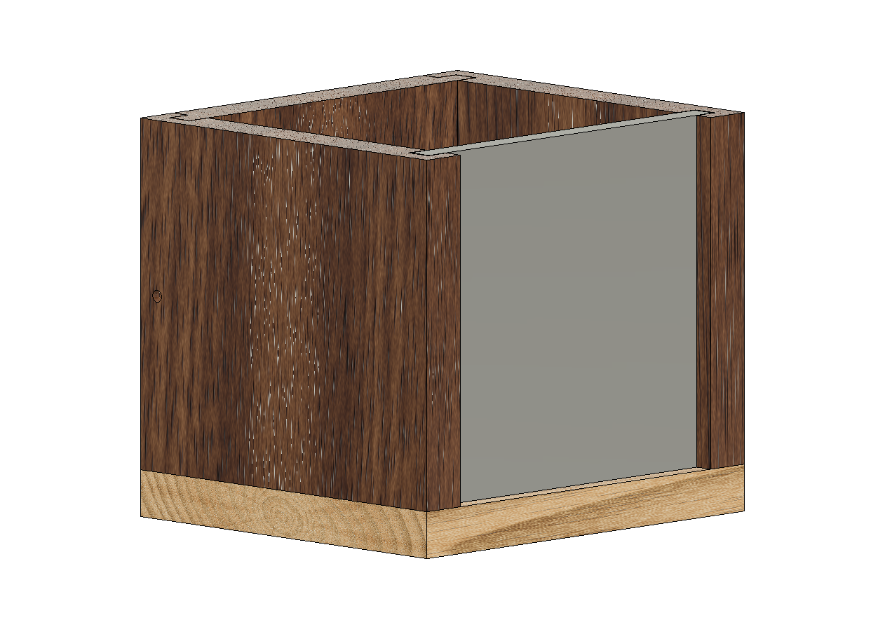
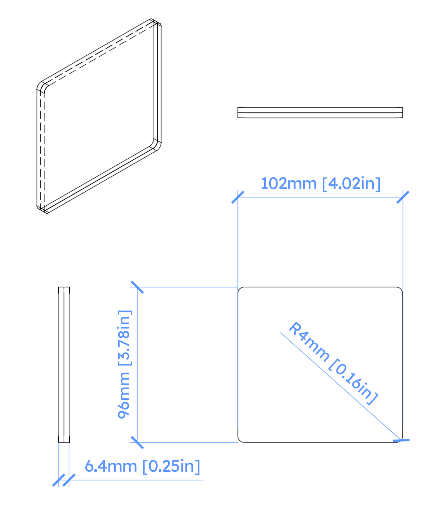
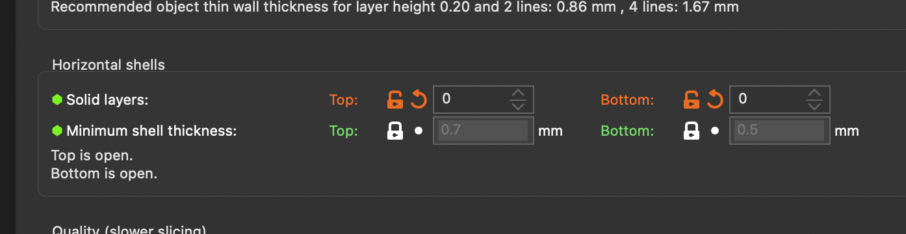
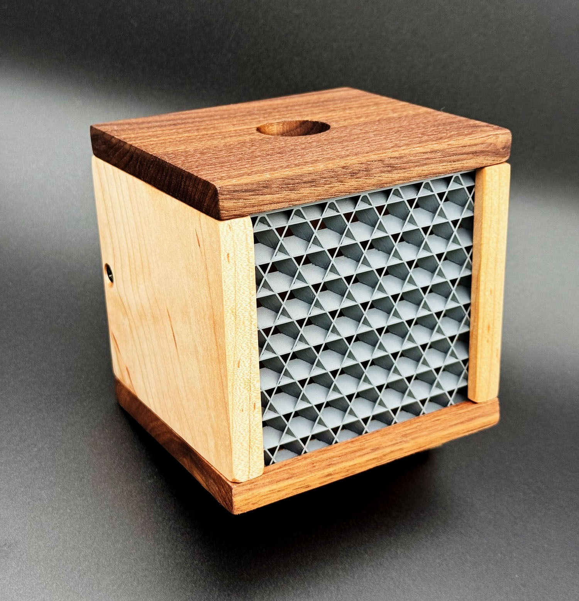

# Art Plates

User-swappable exterior art is one of the core goals of MODxMOD FURNISHINGS products. Different specifications ensure the best fit for your art pieces.

Our goal is to encourage user-created art, so here are specifications for making your own! See some cool [examples](#examples) below.

## How to use this document

This document provides details on terminology and dimensional specifications. It will also point you to resources. Most units are in metric, and Imperial equivalents are shown where possible. ***Note: Imperial units may be rounded down to the nearest fraction.***

## Quick start

The fastest way to start is to:

- 3D print using the `.STEP` file, or
- Laser cut using the `.DXF` file

Be sure to use one 1/4" material or two 1/8" materials.

## AP102 (Version 1.0)

Starting with the Mod Block product, you can create front art plates that slide into the provided slots. In general, your design should be a 4" coaster.

### Viewable area

Because the art plates rest inside a 6mm slot, the visible area is actually 90x90mm (3.5x3.5").

It is also best to leave a bit of padding around the design, perhaps 10mm (3/8").

### Maximum Dimensions

The maximum dimensions are:

- 102mm wide, 102mm tall, 6.5mm thick
- 4" wide, 4" tall, 1/4" thick

The slot it fits into is machined to:

- 103mm wide, 103mm tall, 7mm deep

You ***must allow*** for a small amount of wiggle room, hence the "102" maximum dimension. Wood will change shape; the plates must slide in/out easily, and there are machining inconsistencies.

The thickness is designed to easily accommodate one 1/4" sheet of plywood or two 1/8" sheets of plywood. Laser-safe acrylic often comes in similar thicknesses.

If you create the maximum 102x102 size, it ***will*** protrude over the top of the Mod Block. This is fine because the box's cap has a recessed slot. However, for designs meant to be used without the box cap, you should use the "short" height.

### Short Dimensions

The recommended dimensions for open-box designs are:

- 102mm wide, 96mm tall, 6.5mm thick
- 4" wide, 3.75" tall, 1/4" thick

### Recommendations

- Round off the corners about 4mm. The slots the art plates sit in may not be perfectly machined.
- Use calipers to ensure the total thickness of the materials doesn't exceed 6.5mm.
- Ensure the materials are clean and smooth.
- To create centered short designs:
  - First design for the maximum 102x102mm dimension
  - Remove the top 6mm of the design, leaving 102x96mm
- The viewable area of the installed art plate is 90x90mm (3.5x3.5"):
  - Repeating patterns should extend the full 102x96mm so they disappear into the slots.
  - Centered designs look best when they have some visual padding. The recommended centered design in the art plate is 74x74mm (2-7/8" square).

## Examples

### Solid front example

Use the `modx-ap102-short.step` or `modx-ap102-short.dxf` files to cut out 1/4" material (or two 1/8" materials).

### Semi-open design example

In your 3D printer slicer software, import the `.STEP` model and ***don't print*** the top and bottom "horizontal shells". This will expose the infill pattern, and you can get some very nice effects.

### Offset layered design

By cutting two 1/8" plates where the rear plate has slightly smaller holes, you get a layered dimensional design:

