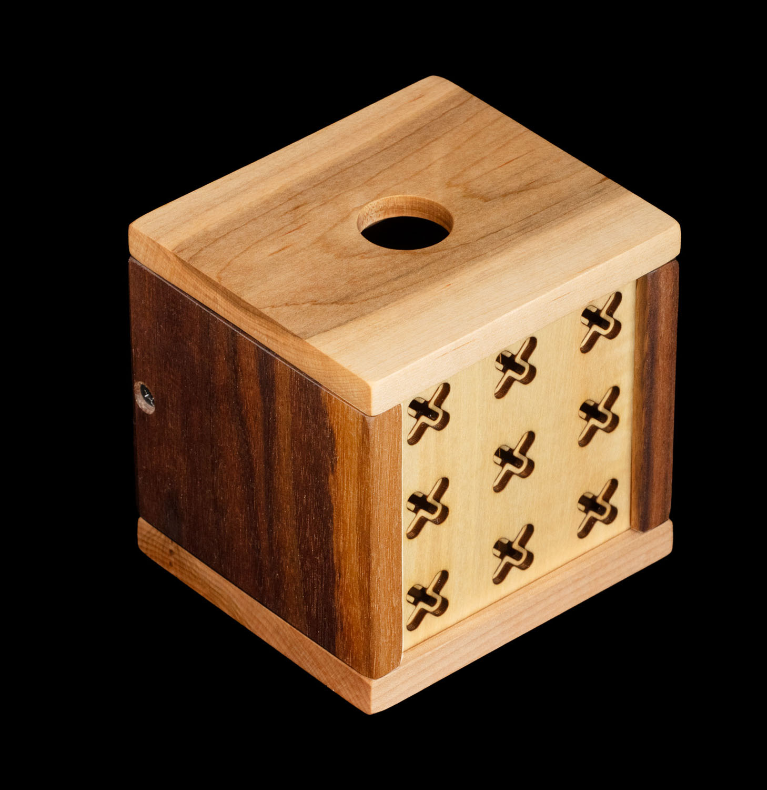
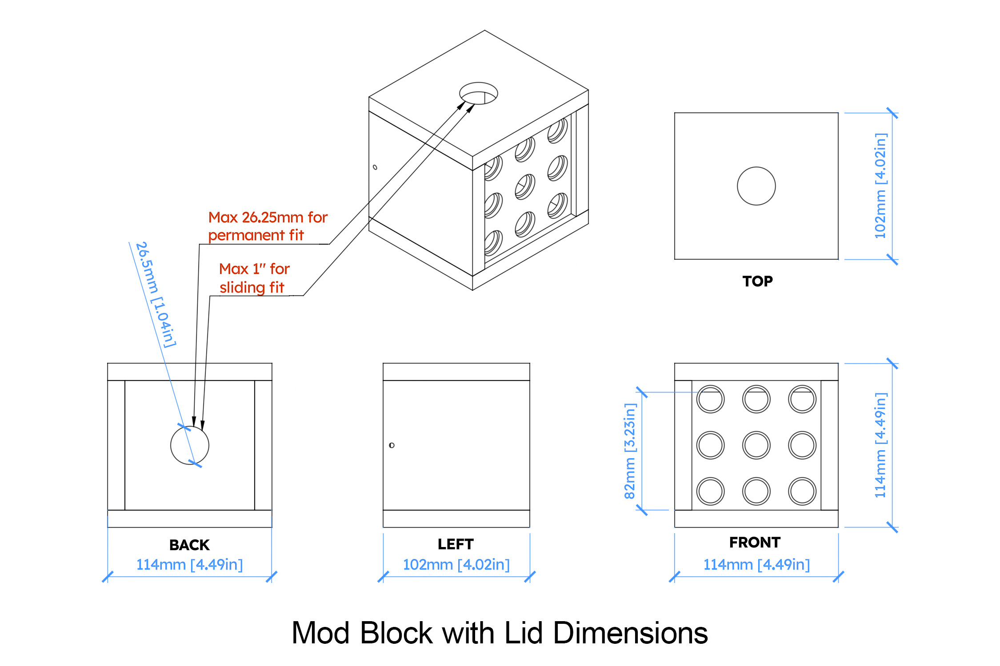
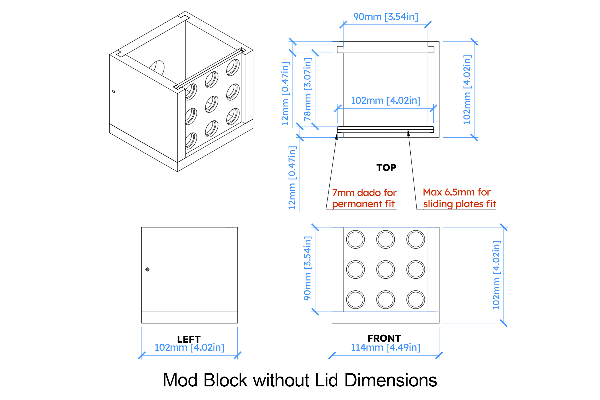
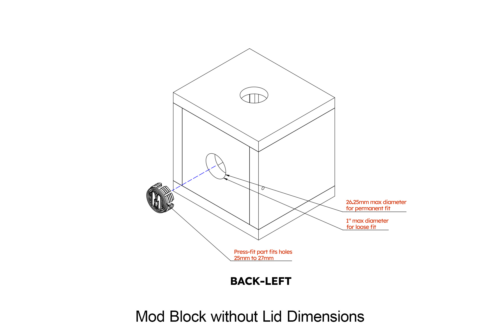
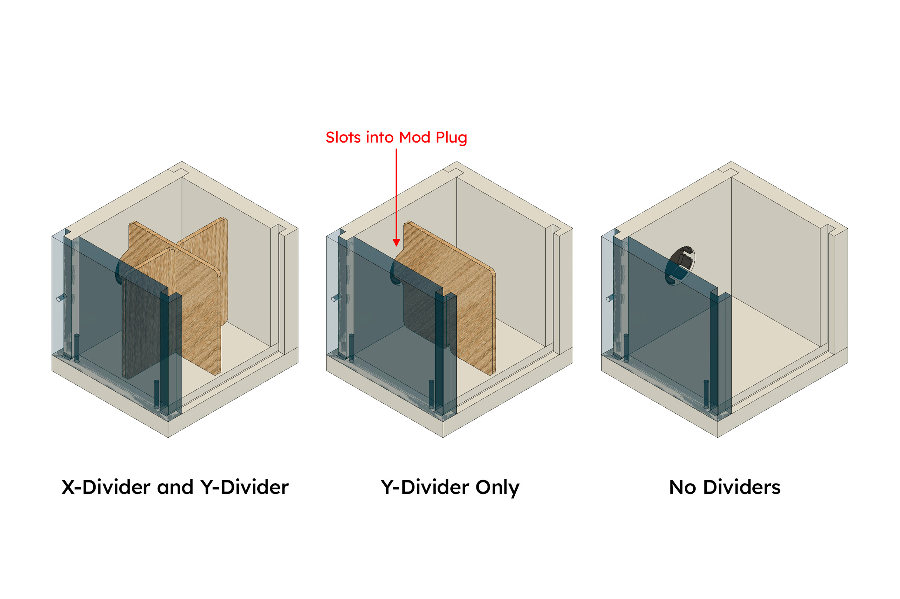
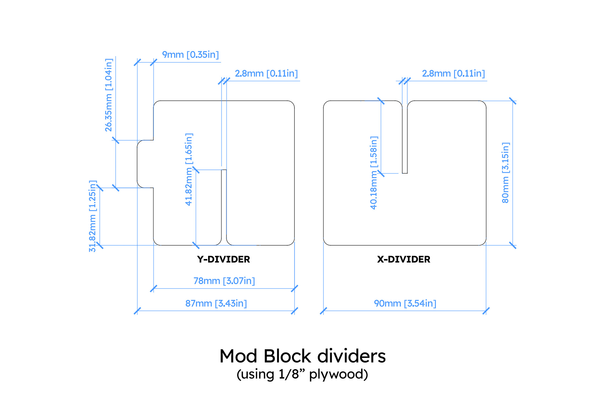

# Mod Block

The Mod Block is intended to be a transformable container. The main features:

- Footprint is 114mm wide by 102mm deep (4.5" wide x 4" deep)
- 12mm thick walls
- Screws-only assembly, no glued walls, no unfinished surfaces
- Symmetric wall 6mm-deep 7mm-wide slots, floor and lid 6mm-deep slots (1/4"), fits a standard 4" coaster
- Standard 1" rear hole, shipped with a 1" press fit 3D printed plug
- 90x90mm viewable area (3.5x3.5")

In the current shipping state as of July 2026:

- Floor secures the walls with screws
- Rear wall screwed in
- Press fit lid with 8mm interior protrusion, 1" finger hole
- User-swappable front plates

## Dimensions with lid on

The current version with lid on measures:

- 114mm wide, 102mm deep, 114mm tall
- 4.5" wide, 4" deep, 4.5" tall

When the front is viewed straight-on, it looks like a square block with a 90mm x 90mm design area (3.5" x 3.5"). The front panel can be swapped with different designs or removed for open access.

*Note: The press fit lid reduces the inner height by 8mm; you should consider 2mm extra padding.*

The effective interior volume is:

- 90mm wide x 78mm deep x 80mm tall
- 3.5" wide x 3" deep x 3.125" tall

## Dimensions with lid off

With the lid off, the Mod Block is 12mm shorter:

- 114mm wide, 102mm deep, 102mm tall
- 4.5" wide, 4" deep, 4.5" tall

But the interior volume is greater:

- 90mm wide x 78mm deep x 90mm tall
- 3.5" wide x 3" deep x 3.5" tall

*If you remove the front art plate, the interior volume can accomodate a 3.5" notepad cube.*

## Rear/top hole Mod Plug

The shipping Mod Block has two 1" openings (machined to 26.5mm), the rear hole is covered with a Mod Plug. The rear hole may change diameter slightly over time due to humidity and material changes.

The Mod Plug or another accessory should adhere to these two diameters:

- 25.4mm (1") for a loose fit. Perfect for dowels or rotating parts.
- 26.25mm for a permanent fit. These parts will likely become difficult to remove; in very dry weather this may become a loose fit.
- 10.5mm is optimal thickness

The shipping Mod Plug has flexible arms which allow it to accommodate holes from 25mm to 27mm. See the [mod_plug](../mod_plug/README.md) directory for specifications.

Permanent installation of a part in the rear or top hole should be done with screws and/or glue. This is especially important if it will be modified.

The Mod Plug design also permits 1/8" material to be slotted into it. See the next section.

## Removable divider panels

The Mod Block ships with 1/8" dividers that have an interlocking slot in their center. The Y-Divider (that goes from front to back) and an X-Divider (that goes from left to right). The Y-Divider has a key that fits into the Mod Plug in the rear wall to keep it vertically aligned. This configuration creates 4 chambers in the Mod Block.

By removing the X-Divider, the Mod Block has 2 chambers. And by removing all of the dividers it is an open box.

You can design new dividers or inserts. The recommended material is 1/8" thick (approximately 3mm thick) because that will fit into the Mod Plug. But you could design new shapes and even a new Mod Plug (or no plug) as it suits your design goals.

## Swappable Art Plates

The front 7mm slots are identical to the rear 7mm slots. In the shipping Mod Block, the front slots have a user-changeable design. 

For more details, please see the [Art Plates](../art_plates/) documentation.

## Resources

- [Mod Block models](./models/)
- [Art Plate models](../art_plates/models/)

## Copyright and license

This file and all other files in this repository are marked with CC0 1.0. To view a copy of this license, visit http://creativecommons.org/publicdomain/zero/1.0
