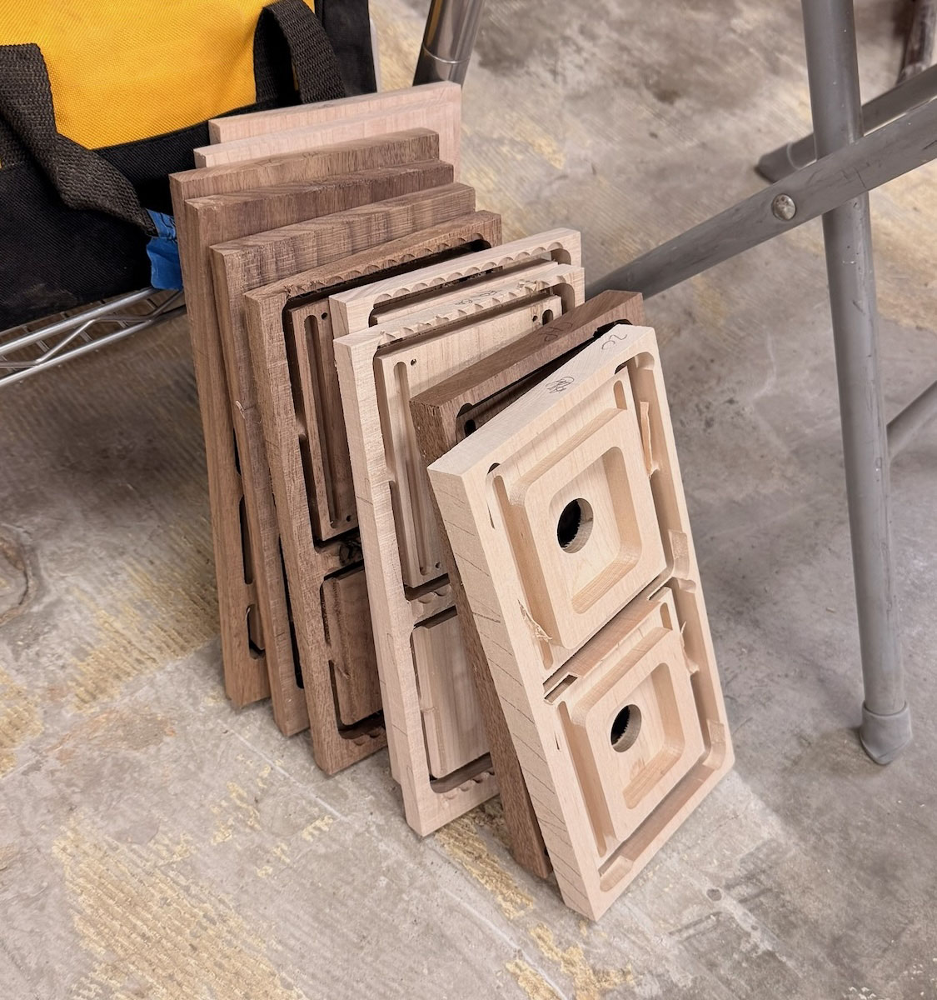
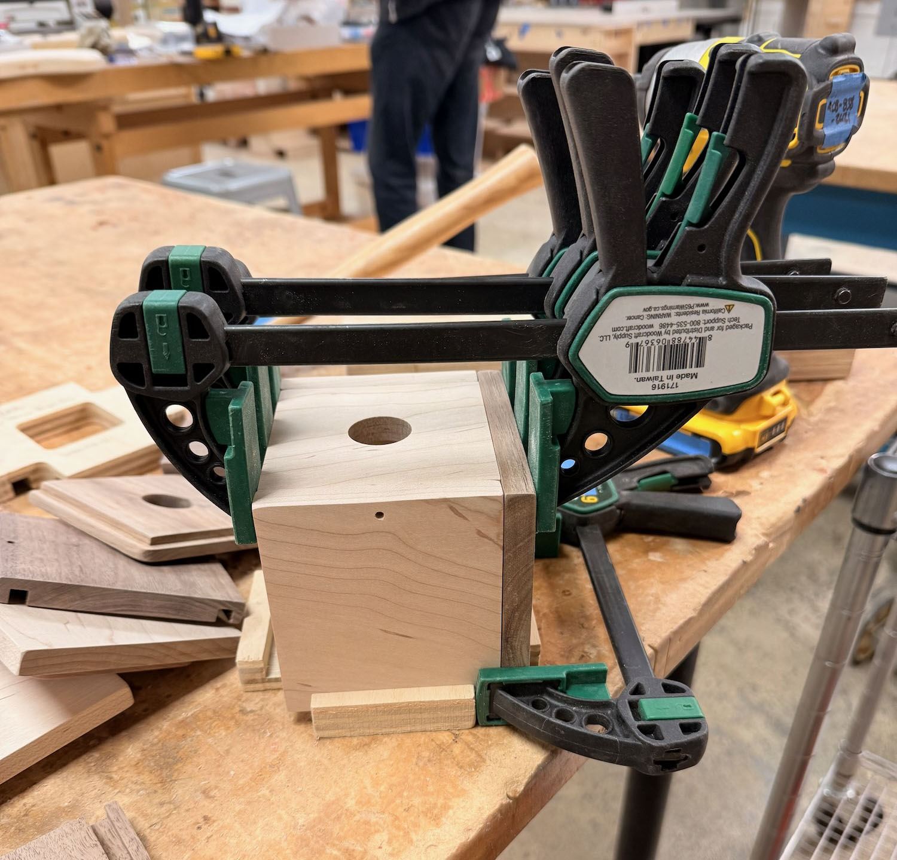

# Mod Block models

The purpose of supplying these models is to assist in providing reference assemblies. They are exported in two different formats:

- `.step` meshes exported directly from CAD, and
- `.stl` models processed through a slicer

See also the [Art Plates models](../../art_plates/models/README.md).

## Rationale

By providing these models, you can construct your Mod Block out of various materials. No specific 3D printer or CNC router is specified, so that you can adapt it to your own equipment.

We hope that you can create fixtures and shelving to hold Mod Blocks, and also create custom solutions that fit the Mod Block's specifications. Tell us about your creations via social media or email: [https://www.modxmod.com/pages/contact](https://www.modxmod.com/pages/contact)

## File descriptions

The main source files are:

| Filename          | Type | Description                                   |
|-------------------|------|-----------------------------------------------|
| MB1-body.step     | STEP | The assembled main Mod Block body in 4 parts. |
| MB1-cap.step      | STEP | Only the press fit cap.                       |

These have been converted into flattened models:

| Filename           | Type | Description                                  |
|--------------------|------|----------------------------------------------|
| MB1-1body.stl      | STL  | The assembled main Mod Block body as 1 part. |
| MB1-multibody.stl  | STL  | Disassembled 4 parts of the Mod Block body.  |
| MB1-cap.stl        | STL  | Only the press fit cap.                      |

## Recommended use

### 3D Printing

3D printing is one of the easiest ways to produce a Mod Block, and you have two primary choices:

- Print the body as one whole part: `MB1-1body.stl`
  - This does not require any fasteners
- Print the separated parts: `MB1-multibody.stl`
  - You may have to print only 1 or 2 bodies at a time depending on the size of your build platform
  - You will have to adjust the model to accommodate your screws and other fasteners (or glue it together)
    - We recommend M3 cap head screws
    - Print the floor screw shafts vertically
    - The wall screw shafts are OK printed sideways:
      - The filament will create a slightly smaller hole than the M3
      - As you twist the screw in, it should cut threads into the filament
    - You may need to adjust the depth of your wall screw shafts to accommodate your desired screw length

### CNC routing

#### Machining tips

Recommended bits:

- 1/4" spiral downcut or 1/4" compression
- 1/8" spiral upcut

The production Mod Block boxes are CNC routed mostly using a 1/4" bit, except for the pilot holes, which are drilled with an 1/8" bit. Tabs are placed along the long edges.

The floor and walls are milled from 12mm stock. The press fit caps are milled from 20mm stock.

We recommend machining with the Z-origin as the machine bed. One of the first operations you can do on the material is a surfacing pass to reduce its thickness to either 12mm or 20mm. (In production, we use S3S 5/4 resawn to 14mm slabs then surfaced to 12mm; and 20.5mm S3S slabs left unsurfaced because they're close enough to 20mm). It is OK if the thickness is slightly thicker than the recommended 12mm and 20mm.

The reason G-code is not provided is that every machine varies and your cuts may be material-dependent.

#### Assembly and finishing tips

There are 4 screw holes in the floor and 2 screw holes in the walls. We recommend:

- Do a moderate amount of sanding and grain raising before sanding to ensure good fit
- Clamp the walls and floor together as one assembly and align the parts
- Use a counterbore hole drilling bit (e.g., search for "1/8 x 3/8 Countersink bit"), and drill far enough that the screw head is *just below* the surface (instead of sitting even with the surface)
- Twist by hand 1" #6 wood screws (or anything that fits the 1/8" diameter holes) into the countersunk holes
- After boring the holes and fitting the screws, disassemble and do final sanding and finishing as desired

This order of operations should give you a better-fitting box.

## To glue or not to glue?

The production Mod Blocks are fastened without glue so the walls can be disassembled for repair or for customization.

To create a permanent Mod Block, you certainly can glue the parts together. You may wish to eliminate the screw holes, or use small dowels in the holes for strength.

## Copyright and license

This file and all other files in this repository are marked with CC0 1.0. To view a copy of this license, visit http://creativecommons.org/publicdomain/zero/1.0
