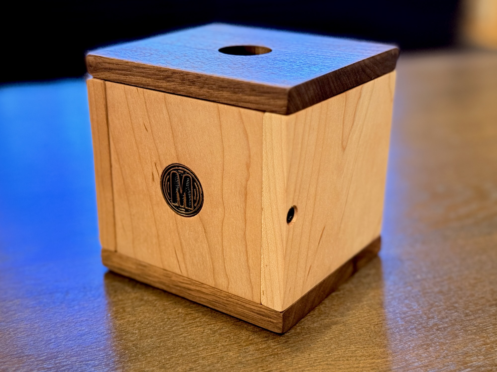
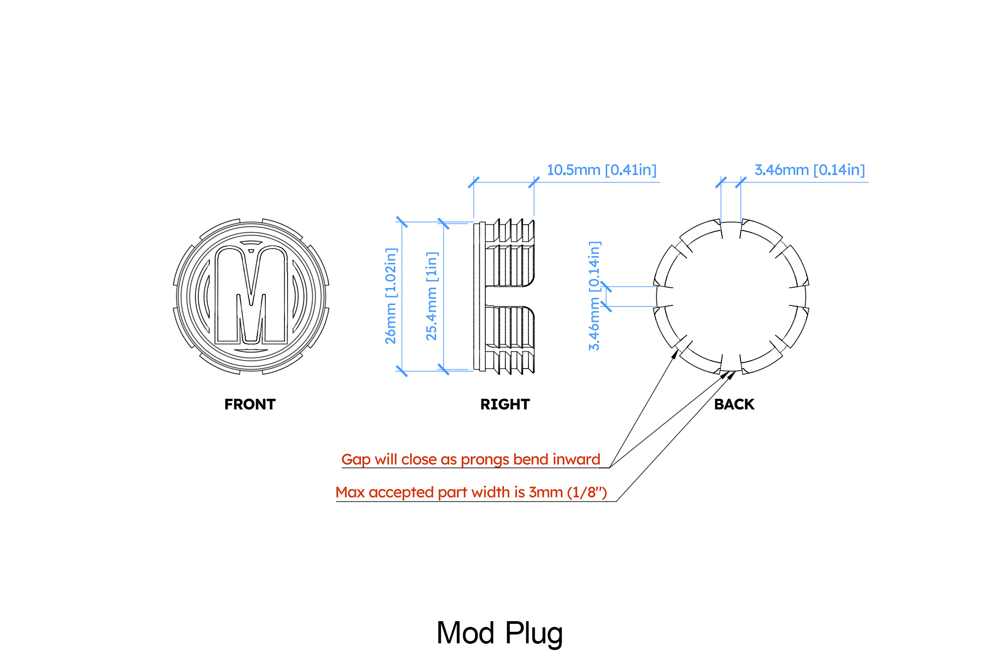

# Mod Plug

The Mod Plug is a press fit part designed to block the rear hole in a [Mod Block](../mod_block/README.md). It can be permanently installed if desired.

## Mod Plug specifications

The provided Mod Plug is a 3D printed part which has flexible arms that should accommodate hole sizes from 25.0mm to 27.0mm. To permanently secure the Mod Plug you should use an adhesive such as epoxy glue or screw the plug into the back wall material.

- No support material required
- PTEG or ABS filament will be stronger, PLA will be more flexible
- Production part uses 0.4mm extruder nozzle
- First bed layers should be 0.5mm, print "logo side" down on bed

## Copyright and license

This file and all other files in this repository are marked with CC0 1.0. To view a copy of this license, visit http://creativecommons.org/publicdomain/zero/1.0
